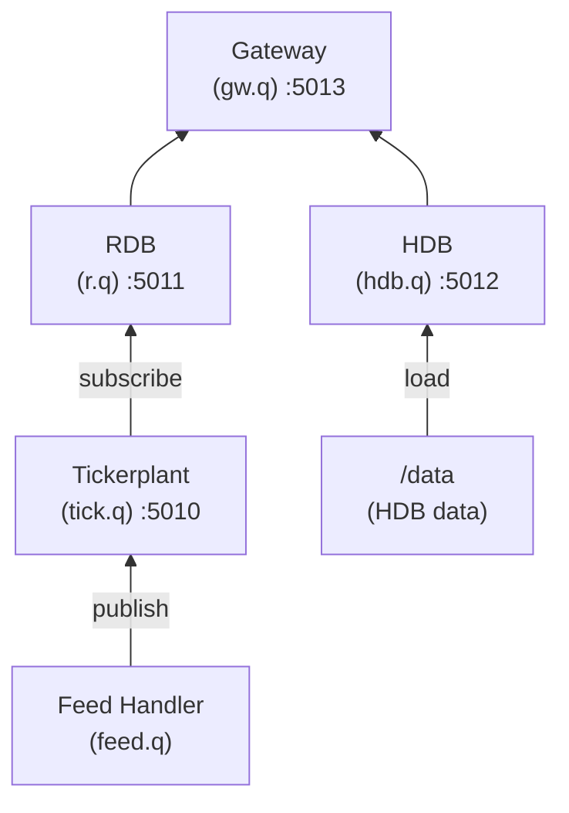

# KDB-X Tick Docker

[](LICENSE)
[](https://hub.docker.com/r/peteclarkez/kdbx-tick)

A dockerized kdb+tick data pipeline using KDB-X, the latest release of kdb+ from KX.

## Overview

This project provides a generic, customizable kdb+ tick data pipeline in Docker. The core tick system is built into the image, while table schemas and custom functions are provided via mounted volumes.

Components:
- **Tickerplant** (Port 5010): Core message broker for real-time data
- **RDB** (Port 5011): Real-time database for current day data
- **HDB** (Port 5012): Historical database for persisted data
- **Gateway** (Port 5013): Unified query interface for RDB + HDB
- **Feed Handler** (optional): Test data publisher

## Architecture



## Volume Mounts

The system uses four external mount points for separation of concerns:

| Mount Point | Purpose | Contents |
|-------------|---------|----------|
| `/data` | HDB data | Date partitions (2024.01.27/), sym file |
| `/logs` | Application logs | tick.log, rdb.log, hdb.log, gw.log, feed.log |
| `/tplogs` | Tickerplant event logs | Binary event logs (sym2024.01.27) |
| `/scripts` | User customization | sym.q (required), feed.q, *_custom.q (optional) |

## Quick Start

### 1. Configure Environment

```bash
cp kdbx.env.example kdbx.env
# Edit kdbx.env with your KX credentials
```

### 2. Create Mount Directories

```bash
mkdir -p data logs tplogs scripts
```

### 3. Add Required Scripts

A schema file is **required** — it defines your table schemas. By default this is `sym.q` (configurable via `TICK_SCHEMA` env var):

```bash
# Copy the example scripts
cp scripts/sym.q scripts/
cp scripts/feed.q scripts/       # Optional: enables test data feed
cp scripts/rdb_custom.q scripts/ # Optional: custom RDB functions
```

### 4. Build and Run

```bash
# Using docker compose (recommended)
docker compose --env-file kdbx.env up -d --build

# View logs
docker compose logs -f

# Stop
docker compose --env-file kdbx.env down
```

For build instructions, multi-architecture builds, customization, gateway usage, environment variables, and other developer documentation, see [DEVELOPMENT.md](DEVELOPMENT.md).

Contributions welcome — see [CONTRIBUTING.md](CONTRIBUTING.md).

## References

- [KDB-X Documentation](https://code.kx.com/kdb-x/)
- [PyKX Documentation](https://code.kx.com/pykx/)
- [Original kdb+tick](https://github.com/KxSystems/kdb-tick)
- [KX Architecture Course](https://github.com/KxSystems/kdb-architecture-course)

## Acknowledgements

Thanks to other kdb tick developers who's forks have educated and inspired some of this work

- https://github.com/MichaelaWoods/kdb-architecture - gateways
- https://github.com/kevin154/kdb-tick-annotated - annotation & comments
- https://github.com/mkst/kdb-tick - annotation & comments
